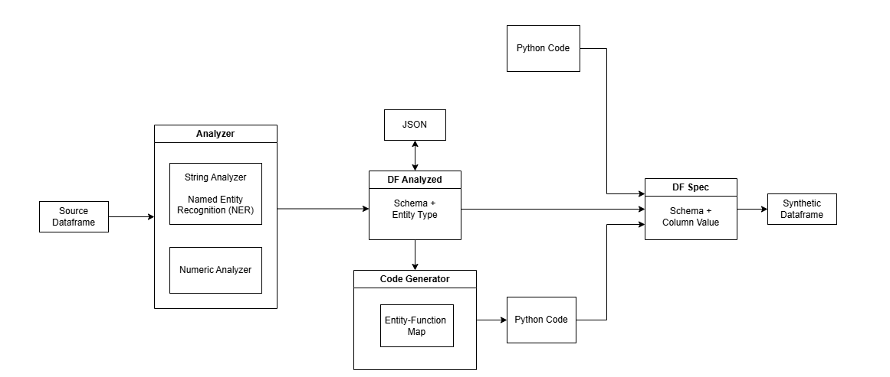

# ParrotPy

ParrotPy is a test/synthetic data generation tool for [Apache Spark](https://github.com/apache/spark).

# Flows


* Build test data from scratch.
* Or analyze existing DF to generate a json spec file, and generate test data from it.
* For more customization, generate python code from spec json file and make tweaks, before generating test data.

# Usage

## Build from Scratch
```python
from parrotpy import Parrot
from parrotpy import functions as PF

parrot = Parrot(seed=123)
builder = (parrot.df_builder()
  .build_column("id",         "int", PF.auto_increment(start=10000, step=3))
  .build_column("name",       "str", PF.name())
  .build_column("address",    "str", PF.address())
  .build_column("birth_year", "int", PF.stats.uniform(min=1925, max=2025))
  .build_column("salary",     "int", PF.stats.normal(mean=70000, std_dev=10000))
)

df = builder.generate(n=100)
```


## From Analyzing Existing Data

```python
# analyze df to generate a dataframe spec
parrot = Parrot(seed=123)
df_spec = parrot.analyzer().analyze_df(src_df)

# optional step, convert to json.
json_str = json.dumps(df_spec.to_dict())
df_spec = parrot.load_df_spec(json_str)

# generate 100 rows
df = parrot.gen_df(df_spec, 100)

```
For security or compliance reasons, developer may not be allowed to generate test data in the production environment. In such case, you can extract 
the data specification and save as json file first, then customize in dev environment as needed.


## Convert Df_spec to Python Code
```python
code_str = parrot.spec2code(df_spec)
```

In command shell
```shell
# analyze df and produce df_spec json file
parrot analyze customers.df   --output customers.json

# analyze df and produce python code
parrot analyze customers.df   --output customers.py

# convert df_spec json to python code
parrot json2py customers.json --output customers.py
```